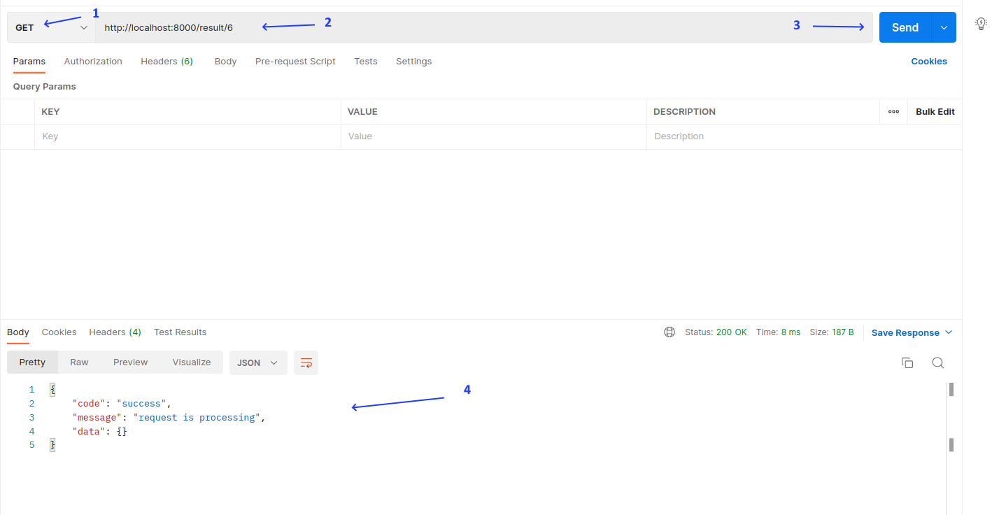
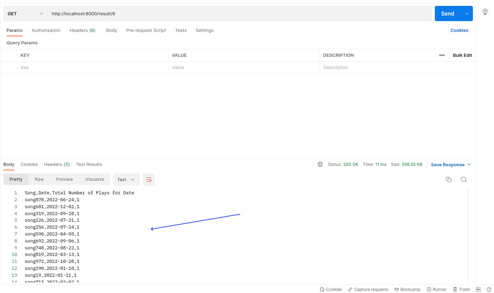
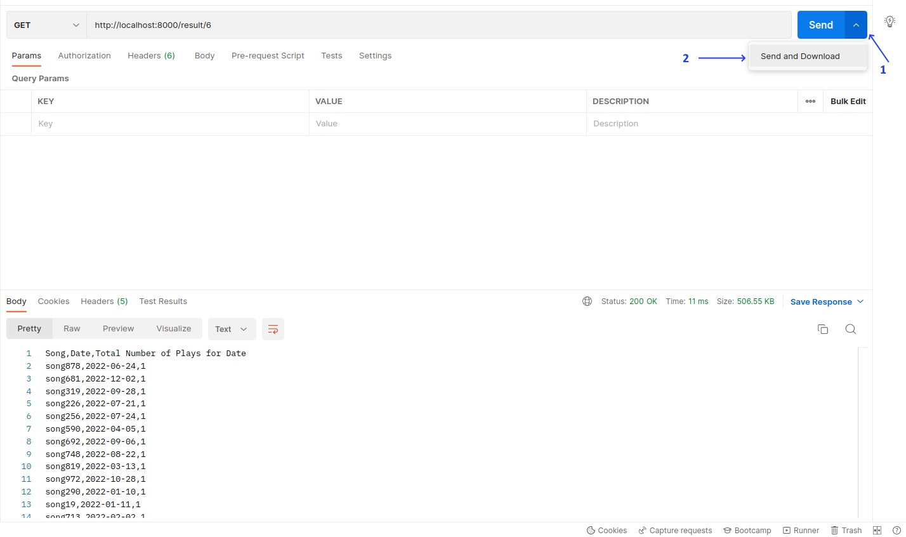

# Large CSV

Candidate: Thuan Nguyen (thuannguyen1259@gmail.com).

In this project, I use FastAPI framework for building APIs

Project structure

    .
    ├── app                     # Test files (alternatively `spec` or `tests`)
    │   ├── main.py             # Main file, including FastAPI app and routes
    │   ├── models.py           # Model of objecys
    │   ├── repositories.py     # Repostory to connect with db
    │   ├── services.py         # Services define business logic (csv processing)
    │   ├── tests.py            # Unit tests
    │   └── utils.py            # Util functions
    ├── db                      # Store DB. For simple, I use .txt to store some primary data in steading using SQLite, MySQL or MongoDB
    ├── inputs                  # Uploaded file via API will be stored here
    ├── outputs                 # Result file will be stored here
    ├── seeds.py                # To seed data for testing
    └── README.md               # Explain project

## I. Large CSV Processing

- In `app/services.py`, I create a service named `SongCSVService`, this service receives requestId and file input
- The large csv file is processed by the following flows:
1. Use `pandas` module to read file data by chunk (`chunk_size=1000`). Because the file is very large and may be larger than memory, so we can't load all data into memory (out of memory). Use a generator to read file by a chunk size will help us to control size of data we process in memory (method `process` in `app/services.py`)
```python
31    chunk: pandas.core.frame.DataFrame
32    for chunk in pd.read_csv(self.input_file, chunksize=1000):
32        self.process_songs_data(chunk.values)
```
2. For each chunk size of data loaded, we process them. Our target, to count all the number of plays for each song in a day and because the input file isn't sorted, so we need a store to temporary save the count of a song. We shouldn't use the memory where to store number of plays of song after processing a chunk data. So I decided use the disk to store data, in here a `.txt` file in will figure out for a song by a day.
For example, with the inputs in problem (`test.csv`), we will have temporary files:

    
    ├── outputs
    │   ├── test_1                                          # test is the input file name and 1 is the request_id
    │   │   ├── tmp
    │   │   │   ├──1                                        # for partition
    │   │   │   │   ├──123                                  # for partition
    │   │   │   │   │   ├──123456                           # for partition
    │   │   │   │   │   │   ├──Umbrella___2020-01-01.txt    # content of file is the number of plays and will be updated when handler meets a data of song in that day
    │   │   │   │   │   │   ├──Umbrella___2020-01-02.txt
    │   │   │   │   │   ├──123789
    │   │   │   │   │   │   ├──In The End___2020-01-01.txt
    │   │   │   │   │   │   ├──In The End___2020-01-02.txt
    └──── ── ── ── ── ── ── ── 

When processing a row, I will update the numbers of play for a song by updating the value in the associated `.txt` file.

```python
song_key_to_nums_of_play = collections.defaultdict(int)
for row in songs_data:
    song_name = row[0]
    date = row[1]
    nums_of_play = row[2]
    song_key = get_song_key(song_name, date)
    song_key_to_nums_of_play[song_key] += nums_of_play

# update the tmp results
for song_key, nums_of_play in song_key_to_nums_of_play.items():
    partition_number = hash_value(song_key)
    tmp_song_key_file_name = self.get_file_url(partition_number, song_key + '.txt')
    current_nums_of_play = 0
    os.makedirs(os.path.dirname(tmp_song_key_file_name), exist_ok=True)
    try:
        with open(tmp_song_key_file_name, mode='rt') as f:
            data = f.read()
            if data.isdigit():
                current_nums_of_play = int(data)
    except IOError:
        pass
    with open(tmp_song_key_file_name, mode='w') as f:
        f.write(str(nums_of_play + current_nums_of_play))
```

Besides, I use a hash function to partition the tmp files into multiple folders. In first, I don't partition and there are too many files in a single folder, so when reading all files of this folder, it increases memory by number of files in a folder.
To avoid that, partitioning will help us to limit number of files in a folder, then we can control the memory when reading files in folder. 

**Note** The hash function and partition I use here is very simple and it is not good solution for other cases

3. Make the output csv file
After step 2, we have the result if `tmp` directory. I read all files in `tmp` folder. With each file, we have a row in output csv.

```
Umbrella___2020-01-01.txt  150        ------>     Umbrella,2020-01-01,150
```
```python
def make_result(self) -> str:
    output_file = f'{self.directory}/result_{self.input_file_name}.csv'
    with open(output_file, 'w', encoding='utf-8') as csvfile:
        output_writer = csv.writer(csvfile)
        output_writer.writerow(['Song', 'Date', 'Total Number of Plays for Date'])
        rows = []
        chunk_size = 1000
        size = 0
        for path, subdirs, files in os.walk(self.tmp_directory):
            for file in files:
                p = PurePath(path, file)
                file_name = p.stem
                song_name, date = get_song_name_and_date_from_song_key(file_name)
                if not song_name or not date:
                    continue
                with open(p, mode='r') as f:
                    data = f.read()
                    if not data.isdigit():
                        continue
                    nums_of_play = int(data)
                rows.append([song_name, date, nums_of_play])
                size += 1
                if size >= chunk_size:
                    output_writer.writerows(rows)
                    size = 0
                    rows = []
        if rows:
            output_writer.writerows(rows)
    return output_file
```
I used `os.walk` to iterate all files in subdir. This is a generator so there is a number of files can be loaded in a time, not all the files.

**The complexity** 

In general, O(N) will be the complexity for both time and space complexity with N is number of rows in input file. We iterate each row once and in the worst case, we will have N `.txt` file for each row 

## II. Async API

I use FastAPI framework for building my APIs, because it's very simple and it supports async function very well.

- For upload, in `main.py`:
```python
def process_request(request_id: int, input_file: str, background_tasks: BackgroundTasks):
    service = SongCSVService(request_id, input_file)
    service.process()
    RequestRepository().update_request(request_id, Status.DONE.value)
    background_tasks.add_task(service.clean_up)


@app.post("/upload")
async def upload(background_tasks: BackgroundTasks, file: UploadFile = File(...)):
    try:
        path = f'{get_project_root()}/inputs/{file.filename}'
        os.makedirs(os.path.dirname(path), exist_ok=True)
        with open(path, 'wb') as f:
            while contents := file.file.read(1024 * 1024):
                f.write(contents)
    except Exception:
        return {
            "code": "success",
            "message": "There was an error uploading the file",
            "data": {}
        }
    finally:
        file.file.close()
    request_id = RequestRepository().create_request(file.filename)
    background_tasks.add_task(process_request, request_id, path, background_tasks)
    return {
        "code": "success",
        "message": "success",
        "data": {
            "requestId": request_id
        }
    }
```
The input file can be very large, so I use uploading by chunk. After storing file, I have a background task named `process_request` to handle request have just been created.
Immediately, I returned `request_id` to the client while file is being processed.

**Note** `request_id` is generated by count the number of file in `db/` folder.

`process_request` will call the service which is defined above

- For download
```python
@app.get("/result/{request_id}")
def get_result(request_id: int):
    request = RequestRepository().get_request_by_id(request_id)
    if not request:
        return HTTPException(status_code=404, detail="request id not found")
    if request.status == Status.DONE.PROCESSING.value:
        return {
            "code": "success",
            "message": "request is processing",
            "data": {}
        }
    result_file_name = f'result_{request.file_name}'

    def iterfile():
        CHUNK_SIZE = 1024 * 1024
        file = Path(request.file_name).stem
        with open(f'./outputs/{file}_{request.id}/{result_file_name}', 'rb') as f:
            while chunk := f.read(CHUNK_SIZE):
                yield chunk

    headers = {'Content-Disposition': f'attachment; filename="{result_file_name}"'}
    return StreamingResponse(iterfile(), headers=headers, media_type='text/csv')
```
I used Streaming Response for a large file.

## Demo

### Installation

Prerequisites
- Python >= 3.8
- python3-venv, python3-dev

`requirement.txt`:
- fastapi==0.88.0
- pandas==1.5.2
- python-multipart==0.0.5
- uvicorn==0.20.0
- uvloop==0.17.0
- httpx==0.23.1

After clone this repository:
1. `python3.10 -m venv .venv` (I use python3.10)
2. `source .venv/bin/activate` (active venv)
3. `pip install -r requirements.txt` (install packages)
4. `uvicorn app.main:app` (to run app)

App will run on http://127.0.0.1:8000

I used [Postman](https://www.postman.com/downloads/) for the client. And here is the demo
- Upload file


I prepared a file named `test.csv` and you can use it for demo (file size is 1MB with 500k rows)

You will get the response with `request_id`

- Download file


If the file is being processed, you will get the json response that indicates the file is processing.

If process is done. You will get the data

Data in response

Or download it as file


## Summary
After finish this project, I see some Pros and Cons of it

### Pros
- The memory is controlled and limited during processing file because service always processes by chunk instead of loading all into memory and use disk as layer for temporary data instead of memory.
- I tried with 100KB, 1MB, 10MB and 20MB. The highest used memory was 5MB for all of them (use tracemalloc and [memory-profiler](https://pypi.org/project/memory-profiler/) to measure)

### Cons
- The process is slow because processing by chunk and with large files, there are too many temporary files to write to disk.

## Thank you for reading
